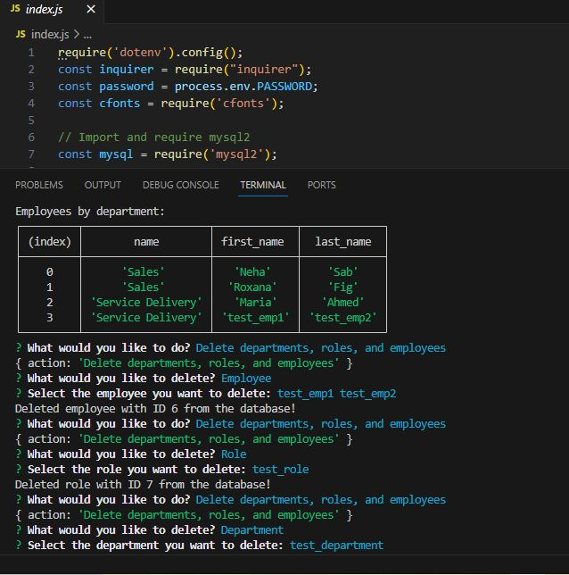

 # Employee Tracker

  ## Description
  My motivation behind this project was to create a content management system for the company's employee database. It has 3 tables, Department, Role and Employee which stores information about the company's department, roles and employees respectively. Questions are provide to the application user via inquirer prompt to view specific data in tabular format

  ## Github Repo link: 
  https://github.com/Nehaps29/companyCMS

  ## Short Video Link showing how it is generated: 
  https://drive.google.com/file/d/1tu6yjfIAuVxgmFvIlhdK3qtL97yTU4Wg/view
  

  ## Picture of generate logo
  
  

  ## Table of Content

  - [Installation](#installation)
  - [Usage](#usage)
  - [Contribution Details](#contribution-details)
  - [Test Instructions](#test-instructions) 
  - [License](#licenses)
  - [Contact](#contact)
  
  

  ## Installation: 
    Node.js, Inquirer, and MySQL
  ## Usage:

  to manage company's employee tracker
  ## Contribution Details: 
     Neha Sabannavar, Rutgers TA, Xpert Learning Assistant, AskBCS, SQL Join Tutorials (https://www.youtube.com/watch?v=bLL5NbBEg2I, w3schools), https://developer.mozilla.org/en-US/docs/Web/JavaScript/Reference/Operators/Nullish_coalescing

  ## Test Instructions: 
   Command to run the script : node index.js

  ## Licenses: 
  MIT
      
  https://opensource.org/licenses/MIT 

  
  ## Contact: 
  Below mentioned is my github profile link 

  ## Github: https://github.com/nehaps29
  
